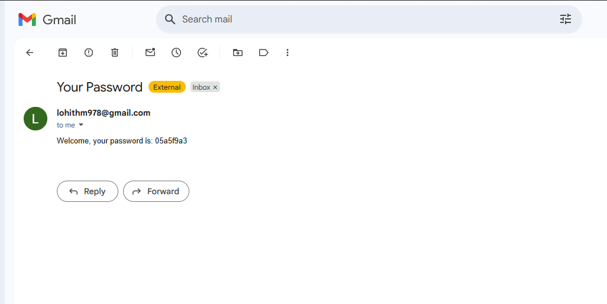
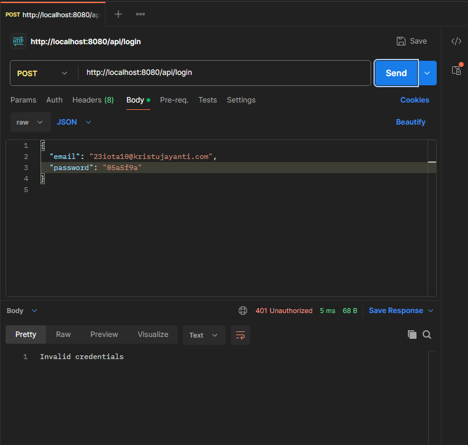
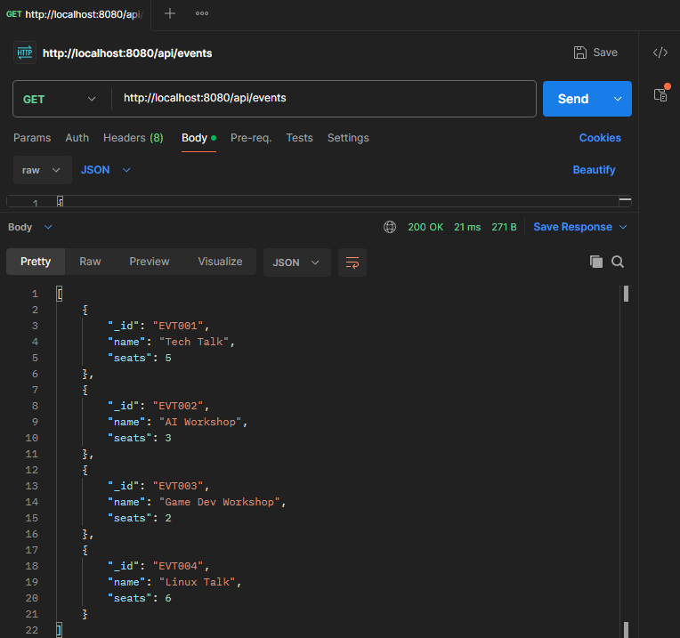
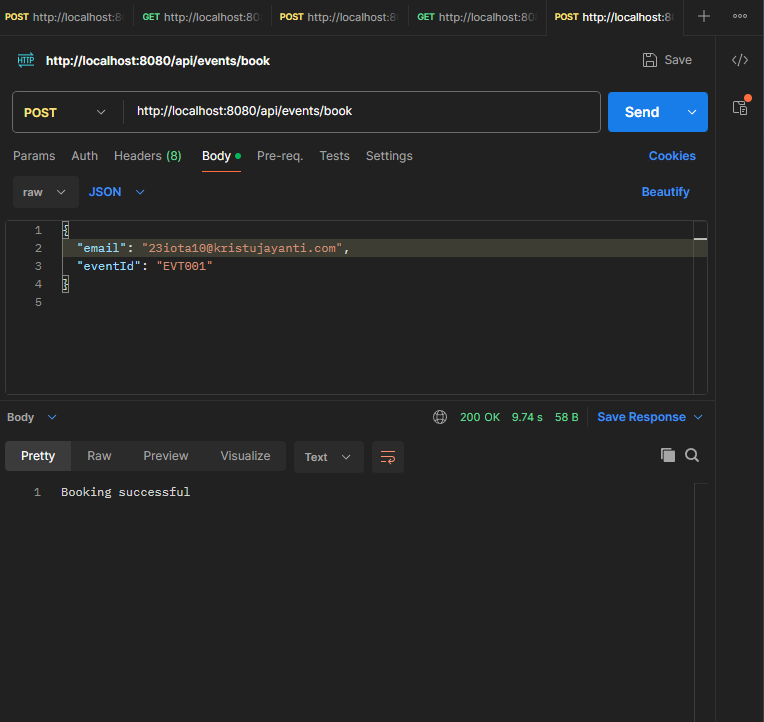
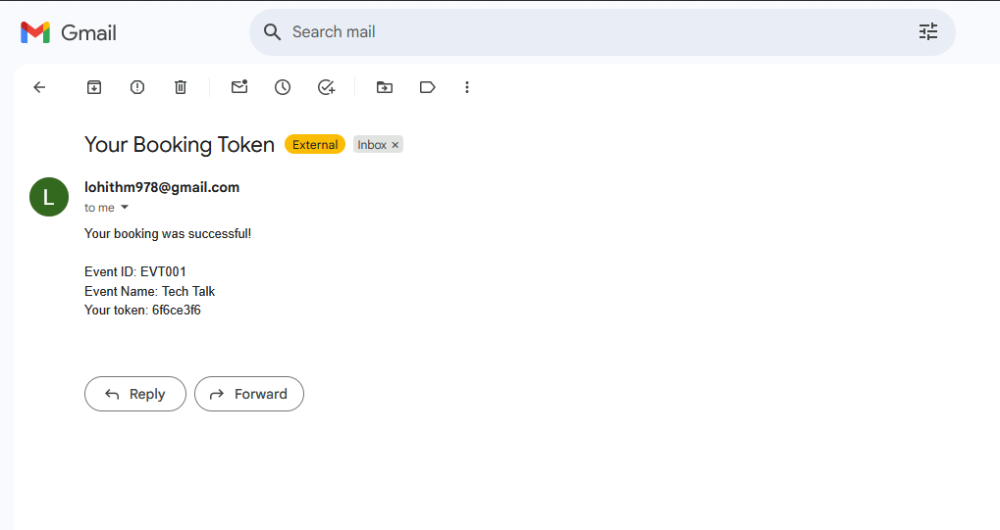
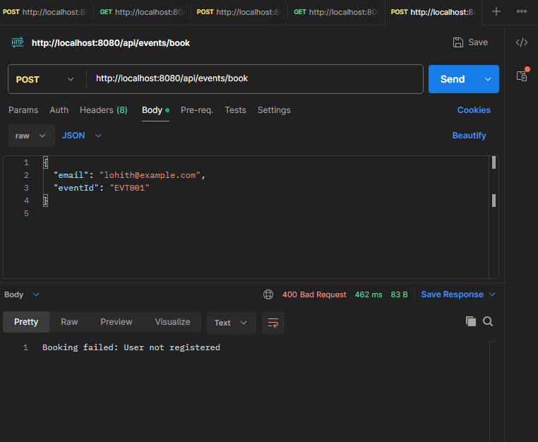
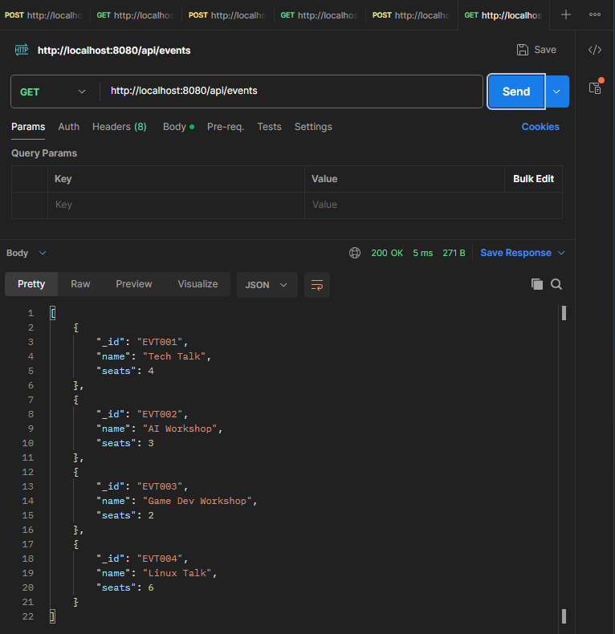

# Day 11 Task

---

### 23IOTA10

Designed a Java-based Event Ticket Token Sy
stem using MongoDB, Vert.x and Postman

- Users register with email and name ✅

- A random password is generated and emailed to the user via SMTP ✅

- users log in using email and password ✅

- user can view a list of events ✅

- users can book a token for a specific event ✅

- After booking, a unique token is generated and emailed to the user ✅

- The events seat count is reduced by one ✅

### Technologies Used

- Java 17

- Vert.x 

- MongoDB Compass (mongodb://localhost:27017)

- Postman (for API testing)

- SMTP (for email sending via Gmail)

### Project Structure

```
src
└── main
    └── java
        └── in
            └── edu
                └── kristujayanti
                    ├── Main.java              
                    ├── MongoConnection.java  
                    ├── handlers
                    │   ├── AuthHandler.java   
                    │   ├── EventHandler.java  
                    │   └── BookingHandler.java
                    └── services
                        ├── AuthService.java   
                        ├── EventService.java  
                        ├── BookingService.java
                        └── MailService.java       
     
```

---

## screenshots

- ### **1: Registration**


- **failed registration**


- **password received**


- ### **2: login**


- **failed login**



- ### **3: Events**




- ### **4: Event Booking**


- **booking success email**


- **failed booking**


- ### **5: Events after booking**

- **MongoDB events after booking**


- **Events after booking**



--- 
## Methods explaination :-
| File                  | Description                                  |
|-----------------------|----------------------------------------------|
| `Main.java`           | Starts the server and sets up routes         |
| `MongoConnection.java`| Connects to MongoDB                          |
| `AuthHandler.java`    | Handles user registration and login routes   |
| `EventHandler.java`   | Handles event listing route                  |
| `BookingHandler.java` | Handles event booking route                  |
| `AuthService.java`    | Logic for user registration and login        |
| `EventService.java`   | Logic to manage events                       |
| `BookingService.java` | Logic to book events and generate tokens     |
| `MailService.java`    | Sends emails using Vert.x MailClient         |

---

## HTTP endpoints :-
| Method | Endpoint         | Description                | Body (JSON) Example                                      |
|--------|------------------|----------------------------|----------------------------------------------------------|
| POST   | /api/register    | Register a new user        | { "name": "abc", "email": "abc@example.com" }            |
| POST   | /api/login       | Login with email and password | { "email": "john@example.com", "password": "abcd1234" }  |
| POST   | /api/events/book | Book a token for an event  | { "email": "doe@example.com", "eventId": "EVT001" }      |
| GET    | /api/events      | Get list of all events     |                                                          |

**Steps to Generate a Google App Password**

1. **Login** to your Google Account
2. Go to the Security tab.
3. find and click **App Passwords** under "Signing in to Google". .
4. For "Select device"and enter a name.
5. Click generate.
6. Copy the 16-character password shown use it in the project.

This project is a educational task given to **23IOTA10**